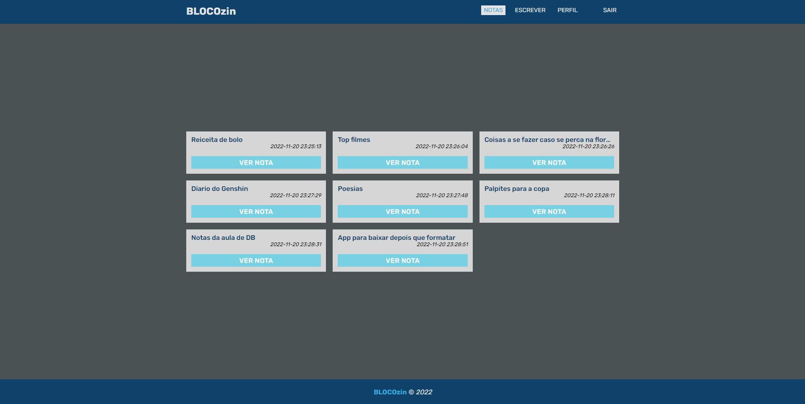
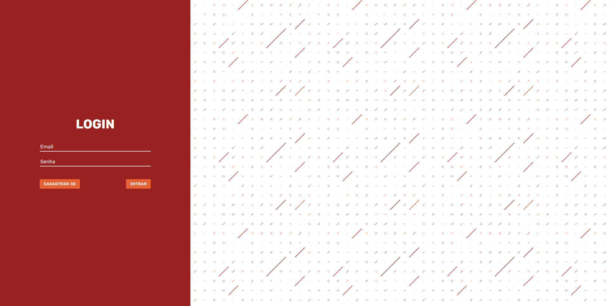
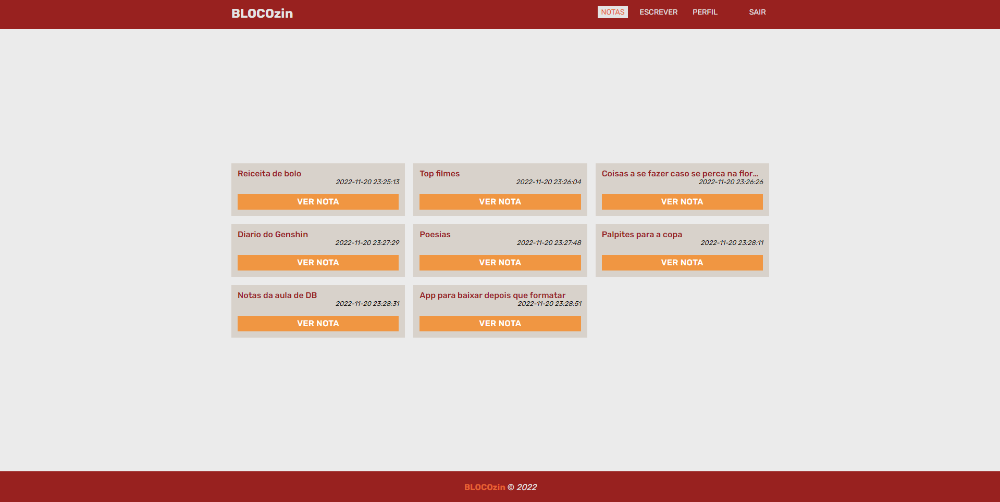

# **_BLOCOzin_**
Projeto desenvolvido para o trabalho da disciplina Aplicações WEB - _Faculdade Projeção_.
### Sobre
Esta aplicação web se propõe a um determinado usuário crie suas notas e as armazenem, com sua disponibilidade para alterar, excluir ou vizualiza-las a partir do mesmo usuário que a criou.

Neste projeto tive oportunidade de testar meus conhecimentos em PHP e no MySQL, e ainda se desafiando com o JavaScript, aliado a isso a curiosidade de aprender uma nova tecnologia, que desta vez foi o SASS, que compõe toda a estilização deste projeto. 
O projeto é construido com o **PHP 8.1** sendo hospedado pelo _Heroku_, juntamente com o **MySQL** sendo hospedado pelo _DB4FREE_. O site também possui todo o modo responsivel para o mobile, tablets etc..
### Tecnologias
* PHP 8.1;
* MySQL;
* HTML5;
* CSS3;
* JAVASCRIPT;
* SASS/SCSS;

### Modo DARK

### Modo LIGHT

